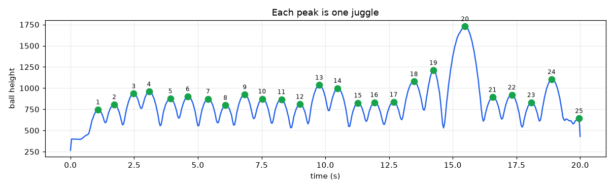
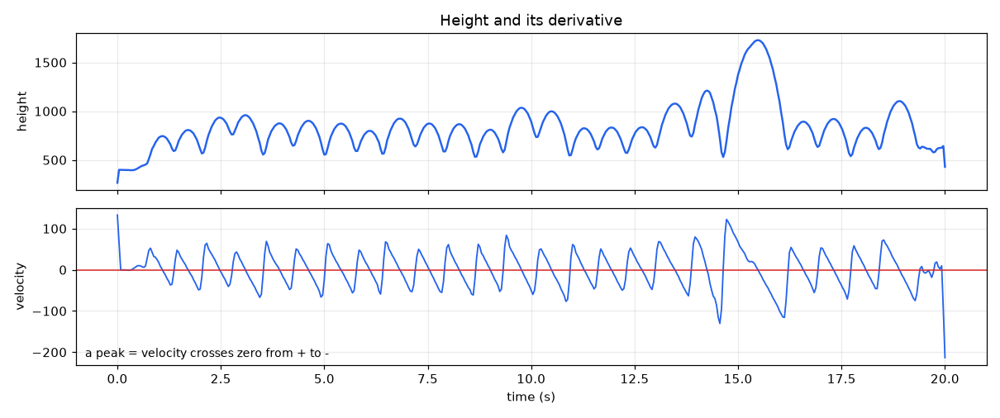
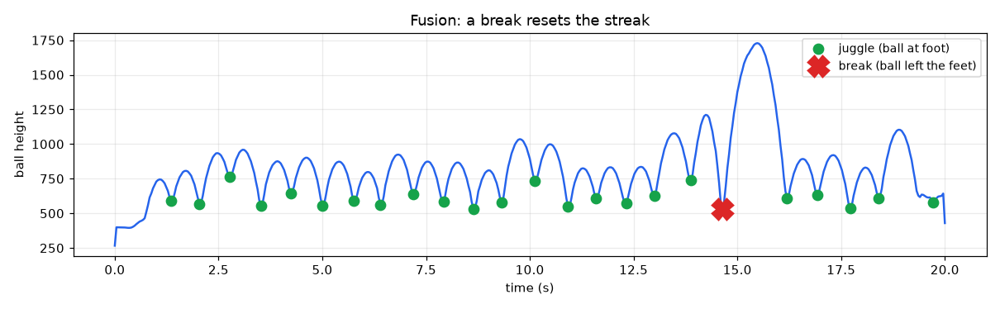

# Football Juggle Detection

Count football juggles in a video with a pretrained YOLO model. No training needed.


## How it works

The ball is already a YOLO class (`sports ball`), so we only run detection, then count with simple math.

**1. Track the ball height. Each peak is one juggle.**



**2. A peak is where the velocity (the derivative) crosses zero from + to -.**



**3. Fusion: also track the feet. A juggle is the ball at a foot; a break is the ball leaving the feet (a drop or failed trick), which resets the streak.**




## Notebooks

- `juggle_counter.ipynb` — simple version (ball height only).
- `juggle_counter_fusion.ipynb` — feet + ball fusion, detects breaks. About 2x slower.
- `live_detect.py` — play a video with the ball box in real time.

## Setup

Python 3.12 required (see `requirements.txt`).

```bash
python3.12 -m venv venv
source venv/bin/activate
pip install -r requirements.txt
```

Put a **sharp** video named `jungle_video.mp4` in this folder and run a notebook. Sharpness matters: on a blurry clip the ball blurs into a white blob and YOLO loses it.
